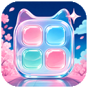

<p align="center"></p>

<h1 align="center">Infinity New Tab</h1>

<p align="center">为 Chrome 桌面端设计的二次元启动台：书签、状态、常访问、动态壁纸与真实折射 Liquid Glass。</p>

<p align="center"><strong>TypeScript · 原生 Web Components · SVG Refraction · WebGPU HDR</strong></p>

Infinity New Tab 不依赖前端框架。页面组件、数据层、光学位移图和 HDR 镜面层均在扩展内部运行，旧版备份可以直接导入。

## 亮点

| 启动台 | 视觉 | 数据 |
| --- | --- | --- |
| 书签、文件夹同网格拖放与右键菜单 | 文章同源的 SVG 物理折射 | Chrome 同步存储（自动分片） |
| 书签 / 常访问一键切换 | WebGPU HDR 镜面高光 | 兼容 1.0 / 2.0 备份 |
| 按需出现的媒体、下载与电量状态 | 根据壁纸明暗自动切换文字配色 | 危险 URL 清洗与去重 |

## 功能

- 首页只有一个视觉中心：居中的时钟与搜索，下方是一块启动台面板。
- 书签和文件夹使用同尺寸图标，文件夹图标内显示前四个站点；进入文件夹后显示面包屑，可把书签拖回“全部”。
- 右键（或悬停后点“⋯”、键盘 Shift+F10）打开菜单：编辑、移动到文件夹、在新标签页打开、删除。
- 启动台顶部可在“书签”和“常访问”之间切换；常访问按网站聚合，优先显示网站首页标题。
- 搜索支持 Google、Bing、百度与 DuckDuckGo，点击引擎标签即可切换；最近搜索以下拉建议显示，可用方向键选择或单条删除。
- 左上角状态只在有媒体播放、下载进行中或使用电池时出现。
- 右上角可一键换在线壁纸；图片会下载并存入 IndexedDB，之后每次打开新标签页都是同一张，不再闪烁。也支持本地图片、循环静音视频、模糊与遮罩调节。
- 文字配色默认“自动”：根据壁纸亮度选择深色或浅色文字。
- 设置分为外观、组件、壁纸、数据四页，按组件分组；所有确认、输入与提示都使用页面内对话框，Esc 可关闭，焦点不会跑到背景。
- 书签与设置存入 `chrome.storage.sync`（书签自动拆分为多个不超过 8 KB 的分片），本地媒体存入 IndexedDB。
- 本地媒体保存或播放失败会明确提示并保留原背景，不会把 Blob 降级写入 Chrome JSON 存储。

## HDR 显示

- “设置 → 外观 → HDR 高光”默认开启，并显示当前屏幕是否支持真实 HDR 输出。
- 在 HDR 屏幕与兼容 Chrome 上，Liquid Glass 叠加一个透明 WebGPU 镜面层，以 `rgba16float` 和 `extended` 色调映射绘制亮度超过 SDR 白色的动态高光；本地 HDR 图片或视频保持原始动态范围。
- 普通 SDR 壁纸不会被伪装成 HDR；不支持 HDR 的屏幕或浏览器会自动使用原有 SDR 配色。
- 设置页的 lip 开关和 convex 滑块共用同一个 WebGPU HDR 渲染器；悬浮、按下或拖动时，高光会贴合真实玻璃拇指移动，不会为每个控件创建独立 GPU 设备。

## Liquid Glass

Liquid Glass 按 [Liquid Glass in the Browser: Refraction with CSS and SVG](https://kube.io/blog/liquid-glass-css-svg/) 的三套光学管线实现：

- 页面只创建一个没有文字、图标或克隆内容的共享光学镜片；原始按钮、书签和文件夹 DOM 保持不变，镜片折射它们真实绘制出的内容。
- 镜片仅在鼠标悬浮或键盘聚焦真实组件时出现，不会常驻鼠标下方。
- 指针离开一个组件并移向同组组件时，镜片位置与形状直接由当前指针投影决定；指针停在中途，镜片也停在对应的中间形态，左右移动不会翻转。
- TypeScript 使用文章的凸面 squircle、折射率 `1.5`、Snell 折射计算和 128 个径向取样位置生成边缘位移场。
- 首页共享镜片采用文章的 Precision Lens：先以 `24px` 中央位移图放大，再以完整折射强度执行边缘折射、`9` 倍饱和度和 `0.5` 镜面高光合成。
- 设置开关采用文章的 lip 表面，凸起外缘与凹陷中心会产生方向相反的折射；按下时折射比例由 `0.4` 连续增强到 `0.9`。
- 壁纸滑块采用文章的 convex 表面、`90×60` 光学图和 `0.6 → 1` 的交互缩放，滑块两侧会真实折射轨道与底层背景。
- 位移图按 `R = 128 + x × 127`、`G = 128 + y × 127` 编码，高光图由固定光照方向和表面法线独立生成。
- 每次稳定落到新组件时，运行时会按镜片实际尺寸生成并缓存中央放大、边缘位移和镜面高光图；移动过程中只更新真实几何，不生成截图或假组件。

实现不保存文章截图或界面贴图；PNG 只作为 SVG 要求的运行时位移/高光数据载体，由算法在浏览器内生成。SVG `backdrop-filter` 按文章说明仅保证 Chromium/Chrome 可用。

## 性能设计

- 设置抽屉只在首次挂载和切换分类时构建 DOM；打开、关闭或保存设置不会重建整张面板。
- lip 与 convex 光学位移图按曲面、尺寸和像素密度缓存，同类开关与滑块复用同一份运行时图像。
- 数据变更按 `bookmarks`、`folders`、`settings.appearance`、`settings.wallpaper`、`settings.layout` 等范围分发，修改滑块不会刷新书签、历史记录或系统状态。
- 首页组件和设置控件复用单一 HDR 画布，交互期间只更新几何与 uniform；不创建截图、克隆 DOM 或逐控件 WebGPU 上下文。

## 数据导入与导出

设置 → 数据提供：

- 导出 `2.0` JSON：包含同步数据及本地图片/视频壁纸。
- 导入旧版 `1.0` 或新版 `2.0` JSON。
- 自动补齐旧备份缺少的状态栏、常访问、主题等设置。
- 自动合并同一文件夹中的重复网址，拒绝 `javascript:` 等危险 URL。
- 导入会覆盖当前扩展数据，建议先导出一份备份。

此前使用的 `bookmarks`、`folders`、`settings`、`todos`、`recentSearches` 与 `lastBackupPrompt` 数据键继续兼容。

## 安装

1. 在项目目录构建 TypeScript：

   ```bash
   npm install
   npm run build
   ```

2. 打开 `chrome://extensions` 并启用开发者模式。
3. 点击“加载已解压的扩展程序”，选择本项目目录。
4. 已经加载过时，点击扩展卡片上的“重新加载”，再打开新标签页。

当前版本应显示为 `2.5.0`。

### 运行要求

- Chrome 120 或更高版本。
- Liquid Glass 的 SVG `backdrop-filter` 以 Chromium 为目标。
- 真正超过 SDR 白色亮度的高光需要 HDR 显示器、WebGPU 和 Chrome 的 extended tone mapping；其他环境自动回退到 SDR。

## 项目结构

```text
infinity-newtab-extension/
├── manifest.json
├── newtab.html
├── styles.css
├── src/
│   ├── app.ts
│   ├── components/       # 原生 Web Components
│   └── core/             # 状态、存储、备份、媒体与历史记录
├── modules/
│   └── app.js            # 构建产物，Chrome 实际加载
├── tests/
│   ├── unit-entry.ts
│   └── e2e/
└── icons/
```

旧的全局 `script.js` 与 `modules/*.js` 运行时已经删除。

## 开发与验证

```bash
npm run build
npm run typecheck
npm test
```

自动化测试不读取日常 Chrome 数据，覆盖：

- 旧版备份清洗与迁移。
- 危险 URL 过滤与同步写入失败回滚。
- 书签拖入文件夹和同文件夹排序不复制。
- 单一空镜片、Precision Lens 双位移管线、滤镜尺寸和全部真实组件覆盖。
- 真实指针停在组件之间时的中间形态，以及左右移动几何一致性。
- 有界面的 Chrome 中真实折射前后的像素必须不同，防止只改变参数却没有画面效果；无界面 Chrome 不合成 SVG `backdrop-filter`，因此界面回归固定使用有界面模式。
- 设置、本地壁纸、导入、导出和备份提醒布局。
- 大量书签的同步分片与旧单键数据迁移，过大内嵌图标拒绝写入。
- 弹窗与抽屉的 Esc 关闭、焦点陷阱和焦点归还；右键菜单移动、文件夹新建 / 重命名 / 删除全程不出现浏览器原生对话框。
- 搜索建议的键盘选择、单条删除与引擎切换。
- 本地壁纸覆盖 IndexedDB 保存失败回滚、原生视频播放失败提示以及刷新后恢复。

仓库不保存界面截图或截图基线；折射回归在测试运行时进行内存像素比较，不产生图片文件。

## 权限与隐私

- `storage`：同步书签与设置。
- `history`：仅在本机统计最近常访问的网站。
- `tabs`：识别正在播放媒体的标签页并支持跳转。
- `downloads`：显示进行中的下载。
- `favicon`：使用 Chrome 本地 favicon 接口获取图标。
- `https://www.dmoe.cc/*`（主机权限）：下载随机壁纸并缓存到本地。该站点不返回 CORS 头，需要此权限才能保存图片。

扩展不会把浏览历史发送给第三方图标服务。随机二次元壁纸依赖 `dmoe.cc` 的可用性；下载后的图片只保存在本机。

## 更新日志

### 2.5.0 - 2026-09-26

- 首页重新设计：时钟与搜索居中作为唯一视觉中心；删除只显示硬件参数的 CPU / 内存面板；状态改为左上角按需出现的小标签。
- 启动台合并书签、文件夹与常访问为一个面板，文件夹改为与书签同尺寸的图标；新增面包屑、右键菜单和“⋯”操作按钮，移除悬浮的添加按钮与重复的“新建文件夹”入口。
- “换张二次元壁纸”移到右上角；在线壁纸下载后缓存到 IndexedDB，修复每次打开新标签页都重新请求、画面闪烁的问题；旧版保存的随机地址会在首次启动时自动迁移。
- 新增“自动”文字配色，根据壁纸亮度切换；旧版本默认的深色文字设置迁移为自动。
- 设置抽屉改为 420px 单栏，分为外观 / 组件 / 壁纸 / 数据；时钟、搜索、启动台、状态各自成组；分段按钮替代原生下拉框；新增日期格式、在新标签页打开、壁纸预览；“重置所有设置”更正为“清空所有数据”。
- 所有 `alert` / `confirm` / `prompt` 替换为页面内对话框与提示；弹窗、抽屉、菜单统一支持 Esc、焦点陷阱和焦点归还。
- 搜索改为自定义建议列表，支持方向键、单条删除，并可点击引擎标签快速切换。
- 修复书签超过约 50 个后 `chrome.storage.sync` 单项 8 KB 上限导致无法保存的问题：书签自动分片存储并兼容旧数据；同步配额错误显示为可理解的中文提示。
- 修复常访问网站名只取域名第一段（如 `news.ycombinator.com` 显示为 “news”）和强行去掉 `www` 的问题。
- 修复书签弹窗无法用 Esc 关闭、关闭按钮贴在标题旁的问题。
- 去掉页面 960px 最小宽度，窄窗口与分屏下不再出现横向滚动。
- 样式表按区块重写并移除重复选择器；Liquid Glass 镜片、lip 开关与 convex 滑块的光学实现保持不变。
- 新增 `.gitattributes` 统一使用 LF 换行。

### 2.4.1 - 2026-08-01

- 设置页开关与滑块接入共享 WebGPU HDR 镜面层，HDR 高光会跟随真实控件位置、缩放和拖动状态。
- 设置抽屉改为常驻 DOM；打开、关闭和保存设置不再重建全部 Web Components。
- 新增 lip / convex 光学图缓存，同类控件不再重复生成高分辨率位移图和镜面图。
- Store 更新改为按数据范围分发，修改外观或壁纸时不会重绘书签、常访问与系统状态组件。
- 新增控件 HDR 几何、光学图复用和保存设置后 DOM 保留回归测试。

### 2.4.0 - 2026-08-01

- 重新逐项核对文章源码，将首页 Precision Lens 参数调整为文章的 `24 / 0 / 9 / 0.5 / 1.0` 管线。
- 新增独立 TypeScript `liquid-toggle` 与 `liquid-range` Web Components，不再用普通 CSS 圆点模拟玻璃控件。
- 布局开关使用文章的 lip 曲面和 `146×92` 位移图；壁纸滑块使用 convex 曲面和 `90×60` 位移图，按下时同步增强折射、降低玻璃底色并放大光学表面。
- HDR 镜面层改为根据圆角表面法线计算整圈方向光、两侧色散和内侧焦散，不再只在左上角出现亮斑。
- 新增 lip 正反向位移、控件光学类型、交互折射强度与滑块实时位置回归测试。

### 2.3.1 - 2026-08-01

- 修复 Chrome 尚未解析 CSS Rec.2100 PQ，导致上一版玻璃 HDR 高光实际没有启用的问题。
- 新增与共享折射镜片同步移动、缩放和变形的 WebGPU HDR 镜面层；使用 `rgba16float` 与 `toneMapping: extended` 输出真正高于 SDR 白色的亮度。
- HDR 高光仅覆盖玻璃边缘和色散，不复制按钮内容，也不改变原有 SVG 折射管线；移动到组件之间时，高光强度随形变连续变化。
- WebGPU 或 HDR 不可用时自动隐藏 HDR 镜面层，保留原有 Liquid Glass 和 SDR 外观。

### 2.3.0 - 2026-08-01

- 新增 HDR 高光开关与实时显示能力检测，连接支持 HDR 的屏幕后自动切换。
- 使用 CSS `dynamic-range-limit: no-limit` 保留本地 HDR 图片与视频的亮度余量。
- 初步加入 HDR 显示检测与 CSS HDR 高光实验；动态玻璃高光在 2.3.1 改由 WebGPU 输出。
- 旧版备份缺少 HDR 字段时自动补齐，不影响现有书签、文件夹、壁纸与设置导入。

### 2.2.1 - 2026-08-01

- 修复 Chrome 沿用旧标签页 favicon 缓存的问题；图标文件保持新版启动台设计，并使用随版本变化的资源地址强制刷新。

### 2.2.0 - 2026-08-01

- 重排首页为“时间与状态控制台、搜索、启动台、常访问”的清晰层级，缩小非核心信息占用空间。
- 启动台改为逐行居中的弹性布局，最后一行只有少量书签时也保持视觉平衡。
- 修复最后一行没有相邻书签时，向右移动鼠标会让 Liquid Glass 错误跳到上一行的问题；镜片现在只寻找当前移动方向上的同行或同列目标。
- 设置页改为桌面端双栏控制台：左侧固定导航，右侧按基础偏好、视觉体验、壁纸来源、画面调节、桌面组件和数据安全分组。
- 统一首页与设置页的樱花粉、天空蓝、圆角、字体、间距和半透明层级，减少重复白色卡片感。

### 2.1.3 - 2026-08-01

- 重绘扩展图标，删除与产品无关的通用紫色无限符号。
- 新图标以四格启动台为主体，融合樱花粉、天空蓝、薄荷色和 Liquid Glass 高光，与首页视觉语言保持一致。
- 分别输出真正的 `128×128`、`48×48` 和简化版 `16×16` PNG；小尺寸不再直接缩放大图，保证标签页和工具栏可辨识。

### 2.1.2 - 2026-08-01

- 删除逐组件内部玻璃层，改为不含复制内容的共享 Precision Lens，直接折射真实控件。
- 加入文章的中央放大图与边缘位移图双阶段 SVG 光学管线，修复只剩描边、没有折射的问题。
- 组件间形变改为由实时指针位置驱动；停在中途保留中间状态，双向移动不翻转。
- 书签、文件夹、搜索、状态、常访问和设置按钮统一接入同一套 TypeScript Web Component 管理器。
- 改用有界面 Chrome 执行像素级折射回归，并保留旧版 `1.0`/`2.0` 数据导入兼容。

### 2.1.1 - 2026-07-30

- 修复 Chromium 首次绑定零强度 SVG 滤镜后不再重绘折射的问题。
- 改为文章示例的完整折射滤镜常驻结构，交互只控制真实折射层的连续呈现。
- 增加搜索框和文件夹的像素级折射回归测试，参数变化但画面不变时测试会失败。

### 2.1.0 - 2026-07-30

- 删除共享滤镜仓库、`liquid-surface` 外壳和直接作用于正文的旧滤镜方式。
- 按文章最终 UI 示例改为“真实控件 + 独立玻璃层 + 同尺寸本地 SVG 滤镜”。
- 按文章源码重写位移场、高光图、SVG 合成顺序和可动画滤镜参数。
- 扩展 Liquid Glass 到搜索、书签、文件夹、常访问、状态面板和实际按钮。
- 保持旧版 `1.0`/`2.0` 备份导入与现有 Chrome 存储数据兼容。

### 2.0.0 - 2026-07-29

- 全面替换为 TypeScript + 原生 Web Components 架构。
- 删除全局脚本、旧模块、旧 Liquid Glass 运行时和截图基线。
- 按文章的逐组件 SVG 位移图与镜面高光管线重写 Liquid Glass。
- 重写书签事务与拖放，修复移动、排序导致复制的问题。
- 保留旧数据键和 `1.0` 备份导入，导出格式继续为 `2.0`。
- 重写单元测试与 Chrome 界面回归测试。
